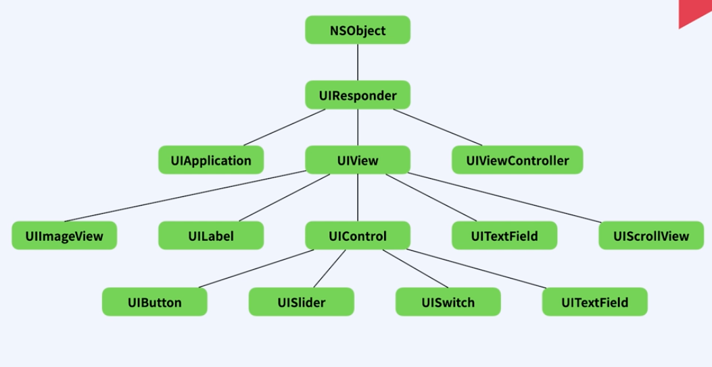
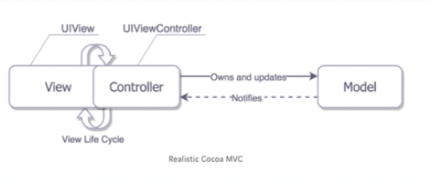

> # [swift] BASIC_01. UIKit

 

# UIKit

## Cocoa Touch FrameWork
- IOS 개발 환경을 구축하기 위한 최상위 프레임워크  
- IOS Application (UIkit, Foundation등)을 포함한다.

 
 

## Foundation
 - 가장 기본적인 데이터 타입부터, 자료구조, 각종 구조체, 타이머, 네트워크 통신 파일 관리 등 **기본적인 프로그램의 중심을 담당**한다.

 
 

## UIKit
 - 사용자의 인터페이스를 관리한다.
 - 이벤트를 처리하는 것이 주 목적이다.

 
 
 

# Code Structure of a UIKit App

UI 킷의 구조는 기본적으로 MVC 디자인 패턴을 사용한다.

 

## 현실 MVC
뷰와 컨트롤러가 강하게 연결되어 있어 뷰컨트롤러가 거의 모든 일을 담당한다.  
뷰와 컨트롤러는 분리하기 어려우며, 프로젝트 규모가 커질 수록 컨트롤러의 크기가 거대해지고 유지보수가 힘들어진다.  
이를 해결하기 위해 MVVM, 바이퍼 패턴 등으로 해결할 수 있다.  

