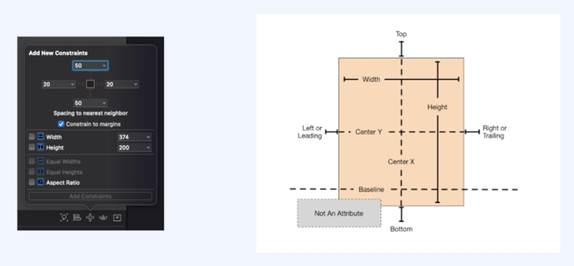
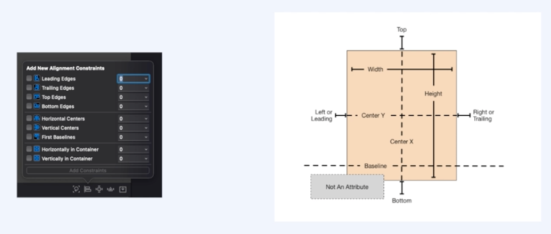
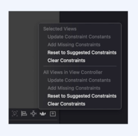

> # [swift] BASIC_02. UIViewController, AutoLayout

 

# ViewController

## UIView
 - 화면의 직사각형 영역에 대한 내용을 관리하는 개체

 

## ViewController
 - 앱의 근간을 이루는 객체
 - 모든 앱은 최소한 하나 이상의 뷰 컨트롤러를 가지고 있다.

 

## ViewController의 주요 역할
 - 데이터 변화에 따라서 view 컨텐츠를 업데이트
 - view들과 함께 사용자 상호작용에 응답
 - view를 리사이징하고 전체적인 인터페이스의 레이아웃 관리
 - 다른 viewController들과 함께 앱을 구성

 
 
 

# AutoLayout

## AutoLayout
 - 제약 조건(Constraints)를 이용하여 뷰의 위치를 지정하는 것
 - 아이폰의 다양한 해상도 비율에 대응하기 위해 나온 것
 - 다른 해상도에서도 화면을 똑같이 보여주기 위해 사용

 

## StoryBoard
 - IOS앱에 사용자 인터페이스를 시각적으로 표현하여 
 - 컨텐츠 화면과 화면간의 연결을 보여주는 도구

 

## Constraint

 

## align
정렬 제약 조건  

 

## Resolve Auto Layout Issues
AutoLayout 관련 Issues들을 해결하는 것이다.  
업데이트, 누락된 제약을 추가, 삭제, 사용할 수 있다.  
