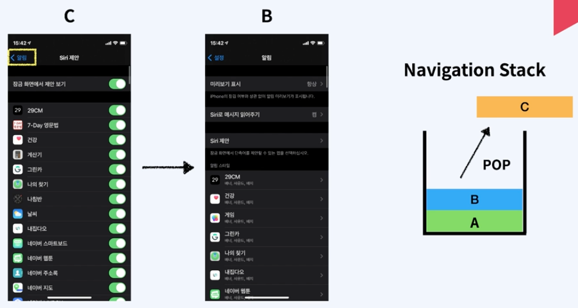
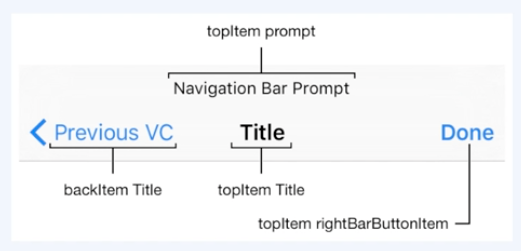

> # [swift] BASIC_03. UINavigationController

 

# View Controller

## Content View Controller
 - 화면을 구성하는 뷰를 직접 구현하고 관련된 이벤트를 처리하는 뷰 컨트롤러

 
 

## Container View Conroller
 - 하나 이상의 Child View Controller를 가지고 있다.
 - 하나 이상의 Child View Controller를 관리하고 레이아웃과 화면 전환을 담당한다.
 - 화면 구성과 이벤트 관리는 Child View Controller에서 한다.
 - Container View Controller는 대표적으로 Navigation Controller와 TabBar Controller가 있다.

 
 
 

# UINavigationController

## UINavigationController
 - 계층 구조로 구성된 content를 순차적으로 보여주는 container view controller이다.

 
 

## Navigation Stack
 - Navigation은 Stack 구조이다.

 
 

## Navigation Bar
