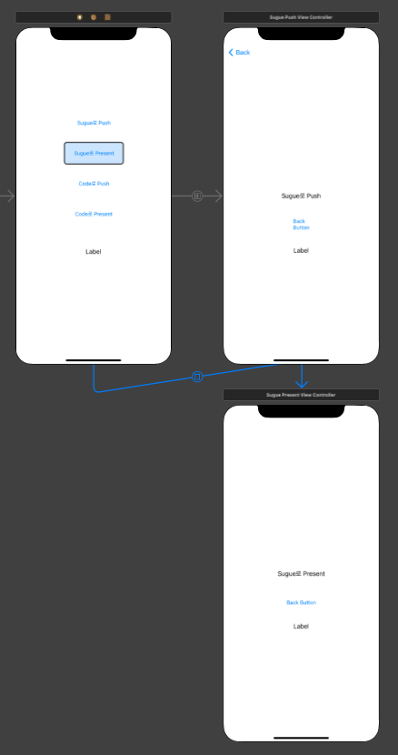

> # [swift] BASIC_04-01. ScreenTransition Code (화면 전환 코드)

<br>

# 화면 전환

## 화면 전환 방법
소스코드를 통해 전환하는 방식과, Storyboard를 통해 전환하는 방식이 있다.  
 - View Controller의 View 위에 다른 View를 가져와 전환하기
 - View Controller에서 다른 View Controller를 호출하여 전환하기
 - Navigation Controller를 사용하여 화면 전환하기
 - 화면 전환용 객체 Segueway(세그웨이)를 사용하여 화면 전환하기

<br>
<br>
<br>

# Code Push

## ViewController.swift
``` swift
import UIKit

class ViewController: UIViewController, SendDataDelegate {

    @IBOutlet weak var lblName: UILabel!
    var name: String?

    override func viewDidLoad() {
        super.viewDidLoad()
        print("ViewController is loaded")
    }

    @IBAction func btnCodePush(_ sender: UIButton) {
        guard let viewController = self.storyboard?.instantiateViewController(withIdentifier: "CodePushViewController") as? CodePushViewController else { return }
        
        viewController.name = "JunHyeok"
        
        self.navigationController?.pushViewController(viewController, animated: true)
    }

}
```

<br>
<br>

## CodePushViewController.swift
``` swift

import UIKit

class CodePushViewController: UIViewController {

    @IBOutlet weak var lblName: UILabel!
    var name: String?
    
    override func viewDidLoad() {
        super.viewDidLoad()
        if let name = name {
            self.lblName.text = name
            self.lblName.sizeToFit()
        }
    }
    
    @IBAction func btnBack(_ sender: UIButton) {
        self.navigationController?.popViewController(animated: true)
    }
    
}
```

<br>
<br>
<br>

# Code Present

## ViewController.swift
``` swift
import UIKit

class ViewController: UIViewController, SendDataDelegate {

    @IBOutlet weak var lblName: UILabel!
    var name: String?
    
    override func viewDidLoad() {
        super.viewDidLoad()
        print("ViewController is loaded")
    }
    
    @IBAction func btnCodePresent(_ sender: UIButton) {
        guard let viewController = self.storyboard?.instantiateViewController(withIdentifier: "CodePresentViewController") as? CodePresentViewController else { return }
        
        viewController.modalPresentationStyle = .fullScreen
        viewController.name = "JunHyeok"
        viewController.delegate = self
        self.present(viewController, animated: true, completion: nil)
    }
    
    override func prepare(for segue: UIStoryboardSegue, sender: Any?) {
        if let viewController = segue.destination as? SuguePushViewController {
            viewController.name = "JunHyeok"
        } else if let viewController = segue.destination as? SuguePresentViewController {
            viewController.name = "JunHyeok1"
        }
    }
    
    func sendData(name: String) {
        self.lblName.text = name
        self.lblName.sizeToFit()
    }

}
```

<br>
<br>

## CodePresentViewController.swift
``` swift
import UIKit

protocol SendDataDelegate: AnyObject {
    func sendData(name: String)
}

class CodePresentViewController: UIViewController {

    @IBOutlet weak var lblName: UILabel!
    var name: String?
    weak var delegate: SendDataDelegate? // delegate 변수 앞에는 weak를 붙인다.(안붙이면 메모리 누수가 발생)
    
    override func viewDidLoad() {
        super.viewDidLoad()
        if let name = name {
            self.lblName.text = name
            self.lblName.sizeToFit()
        }
    }
    
    @IBAction func btnBack(_ sender: UIButton) {
        self.delegate?.sendData(name: "JunHyeok")
        self.presentingViewController?.dismiss(animated: true, completion: nil)
    }
    
}
```

<br>
<br>
<br>

# Seguement

## Main.storyboard



<br>
<br>

## SeguePushViewController.swift
``` swift
import UIKit

class SuguePushViewController: UIViewController {
    
    @IBOutlet weak var lblName: UILabel!
    var name: String?
    
    override func viewDidLoad() {
        super.viewDidLoad()
        print("SegueViewController is loaded")
        if let name = name {
            self.lblName.text = name
            self.lblName.sizeToFit()
        }
    }
    
    @IBAction func btnBackbutton(_ sender: UIButton) {
        self.navigationController?.popViewController(animated: true)
        self.navigationController?.popToRootViewController(animated: true)
    }
    
}
```

<br>
<br>

## SeguePresentController.swift
``` swift
import UIKit

class SuguePresentViewController: UIViewController {
    
    @IBOutlet weak var lblName: UILabel!
    var name: String?

    override func viewDidLoad() {
        super.viewDidLoad()
        if let name = name {
            self.lblName.text = name
            self.lblName.sizeToFit()
        }
    }
    
    @IBAction func btnBackButton(_ sender: UIButton) {
        self.presentingViewController?.dismiss(animated: true, completion: nil)
    }

}
```