> # [swift] BASIC_06. UIStackView

 

# UIStackView

열 또는 행에 View 들의 묶음을 배치할 수 있는 간소화된 인터페이스

UIStackView를 사용하지 않으면 제약조건이 많이 필요하다. 하지만 UIStackView를 사용하면 복잡한 제약조건 없이 구성이 가능하다.  

 
 

## Vertical Stack View, Horizontal Stack View
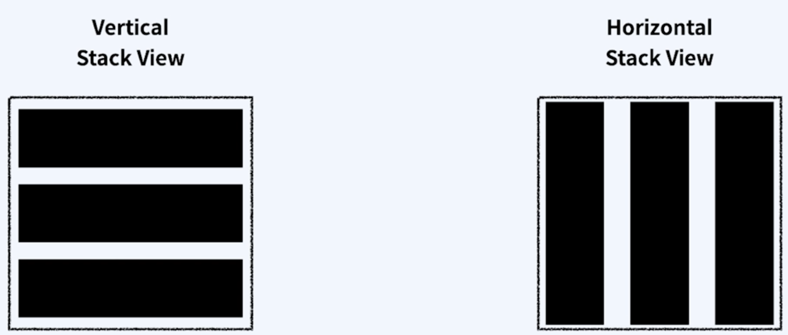

 
 

## UIStackView Attribute
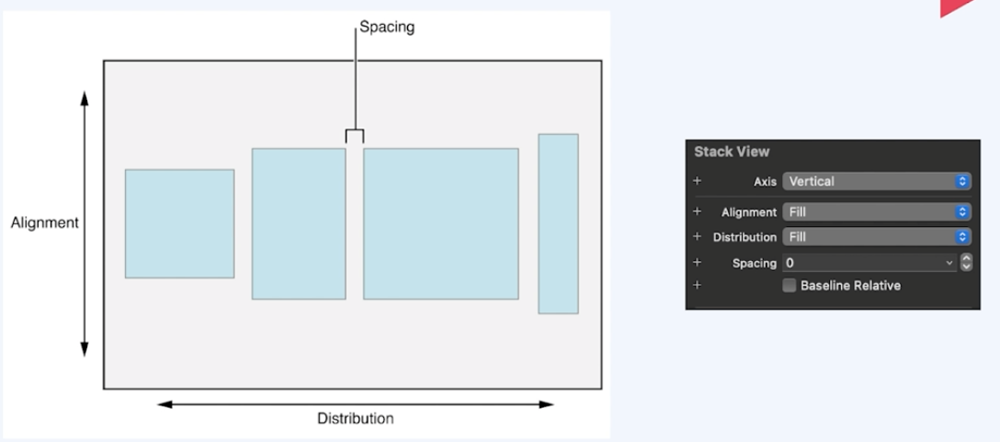

 
 
 

# UIStackView Distribution

StackView 안에 들어가는 뷰들의 사이즈를 어떻게 분배할지 설정하는 속성

 

**Fill**: UIStackView의 방향에 따라 가능한 공간을 각 SubView의 우선순위를 따져 모두 채우게 된다.  
 - UIStackView안에 들어있는 SubView들의 크기가 더 크다면, **우선순위가 낮은** SubView의 크기를 감소시킨다.
 - UIStackView안에 들어있는 SubView들의 크기가 더 작다면, **우선순위가 큰** SubView의 크기를 증가시킨다.

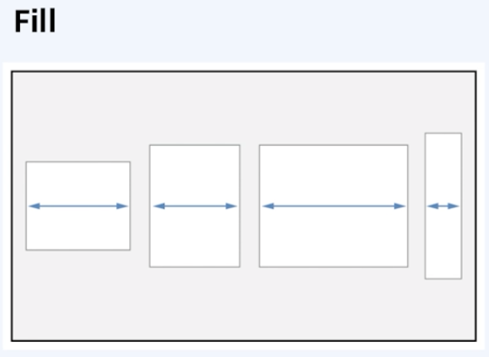

 

**Fill Equally**: UIStackView의 방향에 따라 가능한 공간을 각 SubView의 크기를 동일하게 하여 모두 채우게 된다.  

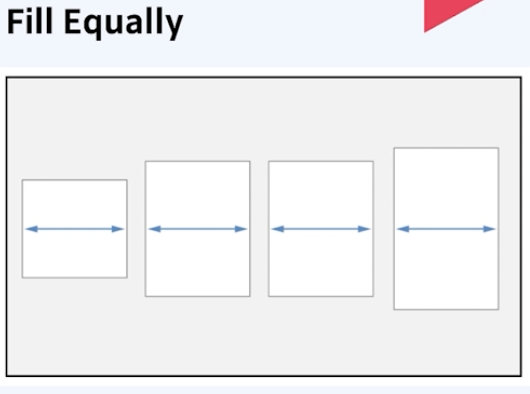

 

**Fill Proportionally**: UIStackView의 방향에 따라 가능한 공간을 비율에 맞춰 모두 채운다.

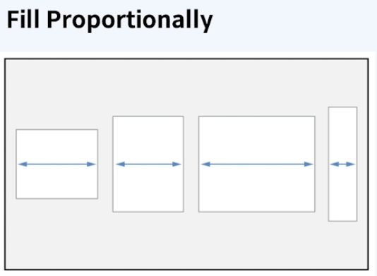

 

**Equal Spacing**: 슬라이드와 같이 View 간 간격이 일정하게 설정된다.

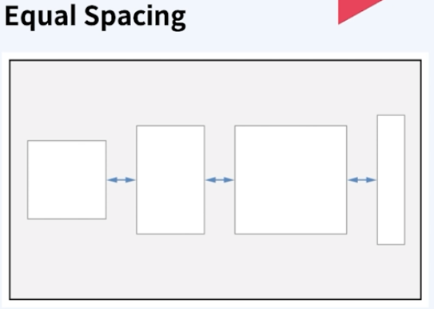

 

**Equal Centering**: StackView의 반영에 따라서 각 SubView의 Center와 Center의 길이를 동일하게 설정한다.

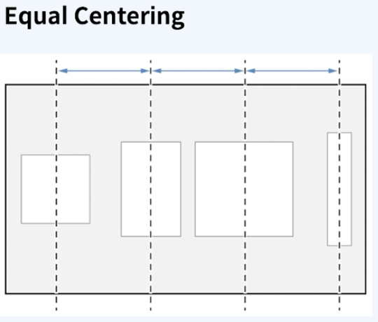

 
 
 

# UIStackView Alignment

StackView의 SubView들을 어떤 식으로 정렬할지 결정하는 속성  

 

**Fill**: 방향이 horizontal일 경우 위, 아래의 공간을 모두 채운다.

 

**Leading**: SubView들이 왼쪽에 정렬된다.

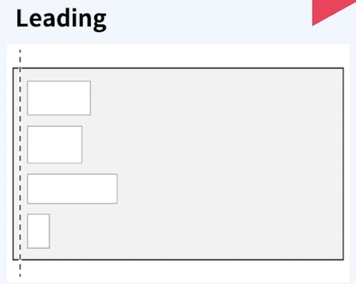

 

**Top**: SubView들이 위쪽에 정렬된다.

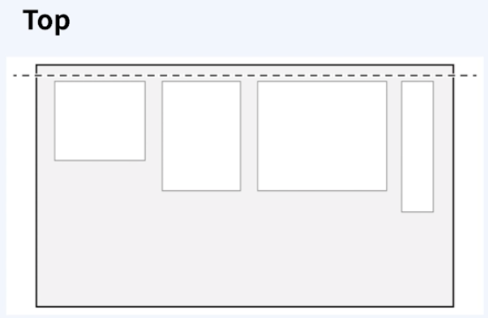

 

**Center**: StackView 방향에 따라 SubView의 Center를 StackView의 Center에 맞춰 정렬한다.

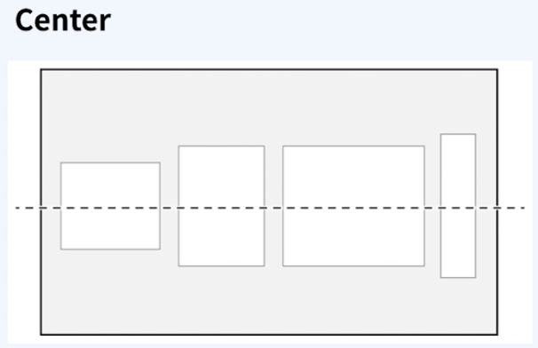

 

**Trailing**: SubView들이 오른쪽에 정렬된다.

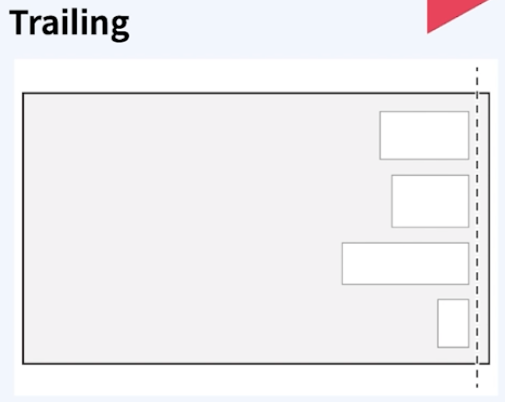

 

**Bottom**: SubView들이 아래쪽에 정렬된다.

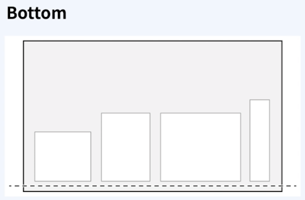

 

**First Baseline**: SubView들의 First Baseline에 맞춰 정렬된다. StackView가 Horizontal일 경우에만 사용 가능하다.

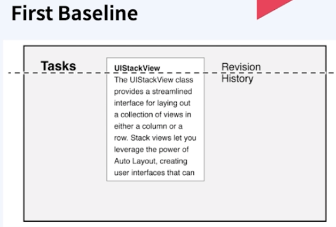

 

**Last Baseline**: SubView들의 Last Baseline에 맞춰 정렬된다. StackView가 Horizontal일 경우에만 사용 가능하다.

 
 
 

# UIStackView Spacing

StackView 안에 들어가는 뷰들의 간격을 조정하는 속성

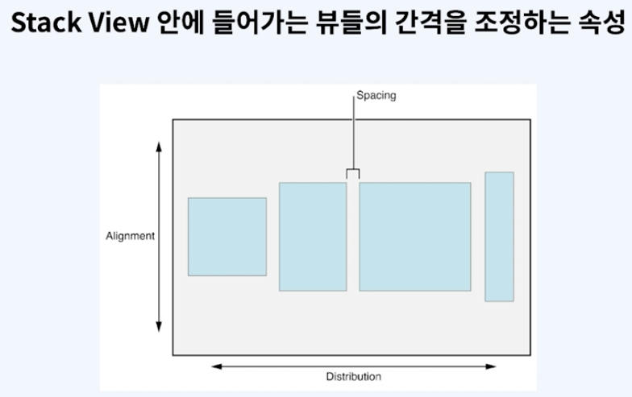