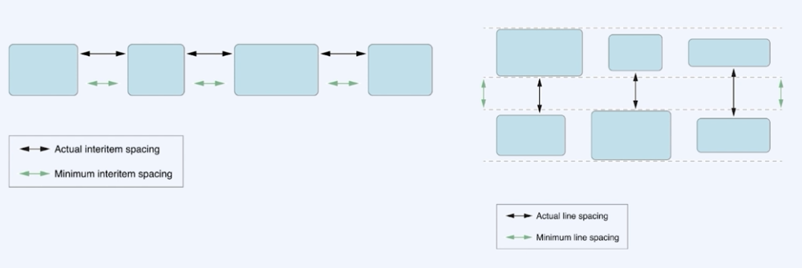
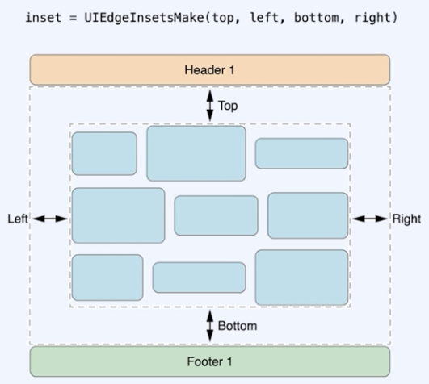

> # [swift] BASIC_08. UITabBar

<br>

# UITabBar

## UITabber
앱에서 서로 다른 하위작업, 뷰, 모드 사이의 선택을 할 수 있도록, 탭바에 하나 혹은 하나 이상의 버튼을 보여주는 컨트롤

<br>
<br>

## UITabBarController
다중 선택 인터페이스를 관리하는 컨테이너 뷰 컨트롤러로, 선택에 따라 어떤 자식 뷰 컨트롤러를 보여줄 것인지가 결정

<br>
<br>
<br>

# UICollectionView
데이터 항목의 정렬된 컬렉션을 관리하고 커스텀한 레이아웃을 사용해 표시하는 객체를 말한다.

<br>
<br>

## Cell
컬렉션 뷰의 콘텐츠를 표시

<br>
<br>

## Supplementary View
섹션에 대한 정보를 표시

<br>
<br>

## Decoration View
컬렉션 뷰에 대한 배경을 꾸밀 때 사용

<br>
<br>
<br>

# CollectionView Layouts

## CollectionView Layouts
 - UICollectionViewLayout
 - UICollectionViewFlowLayout

<br>
<br>

## UICollectionViewFlowLayout
1. Flow 레이아웃 객체를 작성하고 컬렉션 뷰에 이를 할당한다.
2. 셀의 width, height를 정한다.
3. 필요한 경우 셀들 간의 좌우 최소 간격, 위아래 최소 간격을 설정한다.
4. 섹션에 header와 footer가 있다면 이것들의 크기를 지정한다.
5. 레이아웃의 스크롤 방향을 설정한다.

<br>
<br>

## Spacing



<br>
<br>

## Inset



<br>
<br>
<br>

# UICollectionViewDataSource
컬렉션 뷰로 보여지는 콘텐츠들을 관리하는 객체


``` swift
public protocol UICollectionViewDataSource: NSObjectProtocol {
    
    // 지정된 섹션에 표시할 셀의 개수를 묻는 메서드
    func collectionView(_ collectionView: UICollectionView, numberOfItemsInSection section: Int) -> Int

    // 컬렉션뷰의 지정된 위치에 표시할 셀을 요청하는 메서드
    func collectionView(_ collectionView: UICollectionView, cellForItemAt indexPath: IndexPath) -> UICollectionViewCell

    // 섹션의 개수를 묻는 메서드
    eptional func numberOfSections(in collectionView: UICollectionView) -> Int
}
```

<br>
<br>
<br>

# UICollectionViewDelegate
콘텐츠의 표현, 사용자와의 상호작용과 관련된 것들을 관리하는 객체