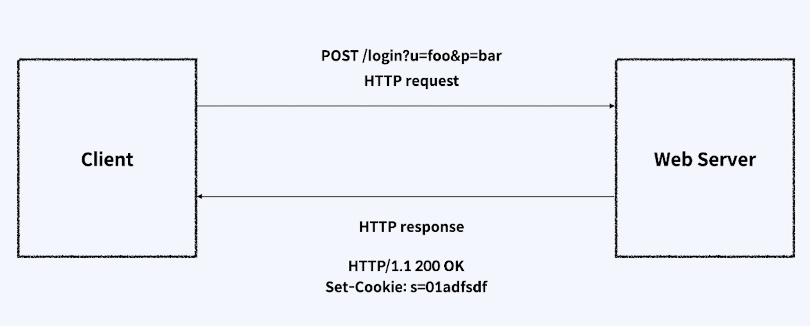
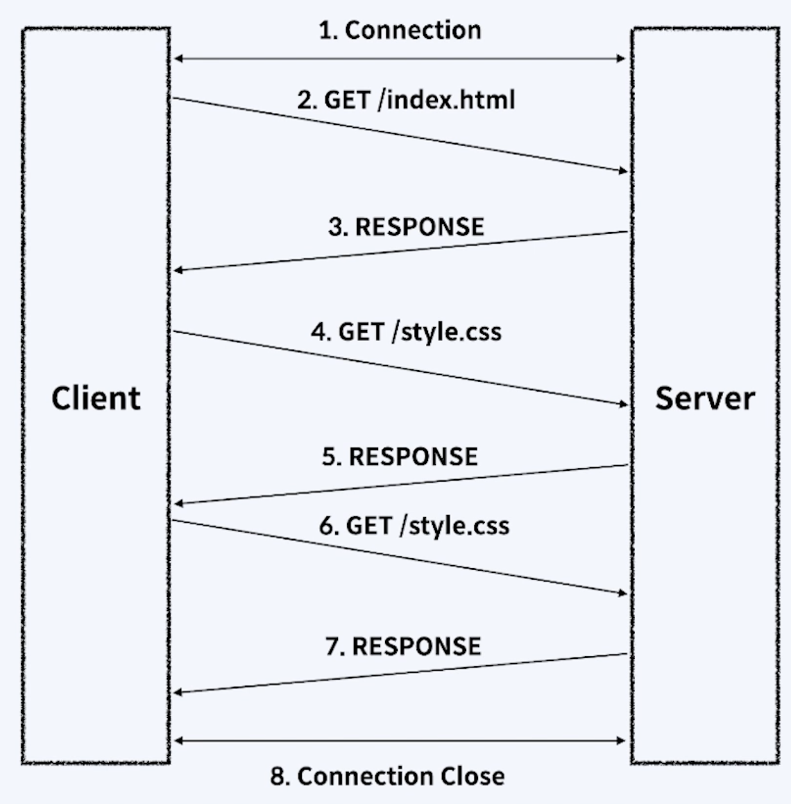
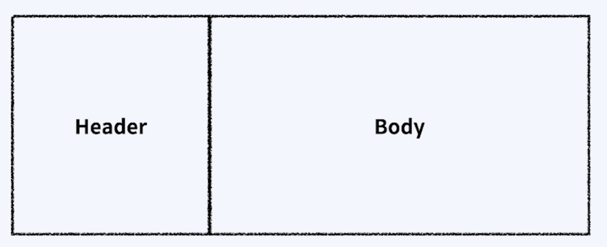

> # [swift] BASIC_10. URLSession

 

# 웹 통신과 Protocol

## 웹 통신
 - 인터넷 상에서의 통신을 말함
 - 많은 정보들이 주고 받기에 인터넷에는 엄격한 규약이 존재한다. 이를 Protocol이라 한다.

 
 
 

# HTTP

## HTTP
HTTP란 Hyper Text Transfer Protocol의 약자이다.  
말 그대로 Hyper Text를 전송하기 위한 Protocol이다.

HTTP 통신은 기본적으로 요청(Request)와 응답(Response)로 이루어져있다.  

 

 
 

## HTTP Packet

HTTP 통신에서는 정보를 Packet에 넣어 보내게 된다.  
Packet은 Header와 Body로 나누어져 있다.
Hader에는 보내는 사람의 주소, 받는 사람의 주소가 담겨져 있다.  
Body에는 보내려는 정보가 담겨져 있다.

 
 
 

# HTTP Method, Status

## Http Method
HTTP 요청을 하려면 URL 주소와 HTTP 메소드를 지정해줘야 한다.  
 - GET: 클라이언트가 서버에 리소스를 <u>요청</u>할 때 사용
 - POST: 클라이언트가 서버의 리소스를 <u>새로 만들 때</u> 사용
 - PUT: 클라이언트가 서버의 리소스를 <u>전체 수정</u>할 때 사용
 - PATCH: 클라이언트가 서버의 리소스를 <u>일부 수정</u>할 때 사용
 - DELETE: 클라이언트가 서버의 리소스를 <u>삭제</u>할 때 사용
 - HEAD: 클라이언트가 서버의 <u>정상 작동 여부를 확인</u>할 때 사용
 - OPTIONS: 클라이언트가 서버에서 해당 <u>URL이 어떤 메소드를 지원하는지 확인</u>할 때 사용
 - CONNECT: 클라이언트가 <u>프록시를 통하여 서버와 SSL 통신</u>을 하고자할 때 사용
 - TRACE: 클라이언트와 서버간 <u>통신 관리 및 디버깅</u>할 때 사용

 
 

## HTTP Status
서버는 클라이언트 요청에 응답하면서, 요청을 성공적으로 이루어졌는지를 알려준다.
 - 100번 대 <u>Informational</u>: 요청 정보를 처리 중
 - 200번 대 <u>Success</u>: 요청을 정상적으로 처리함
 - 300번 대 <u>Redirection</u>: 요청을 완료하기 위해 추가 동작 필요
 - 400번 대 <u>Client Error</u>: 서버가 요청을 이해하지 못함
 - 500번 대 <u>Server Error</u>: 서버가 요청 처리 실패함

 
 
 

# URLSession
## URLSession
특정한 URL을 이용하여 데이터를 다운로드하고 업로드하기 위한 API
 - URLSessionConfiguration: URLSession 생성
 - URLSessionTask: 실제 Server와 통신

 
 

## 세션 종류
 - Shared Session(공유 세션) - URLSession.shared()
   - 싱글톤으로 사용할 수 있다.
   - 기본 요청을 위해 사용하는 세션이다.
   - 맞춤 설정을 할 수는 없다.
   - 쉽게 만들어 사용할 수 있다.
 - Default Session(기본 세션) - URLSession(configuration: .default)
   - 공유 세션과 비슷하게 작동한다.
   - 직접 원하는 맞춤 설정을 할 수 있다.
   - 캐시와 쿠키, 인증 정보 등을 디스크에 저장한다.
   - 순차적으로 데이터를 처리하기 위해 Delegate를 지정할 수 있다.
 - Ephemeral Session(임시 세션) - URLSession(configuration: .ephemeral)
   - 공유 세션과 비슷하게 작동한다.
   - 캐시와 쿠키, 인증 정보 등을 디스크가 아닌 메모리에 저장한다.
   - 세션 만료시 데이터가 사라진다.
 - Background Session(백그라운드 세션) - URLSession(configuration: .background)
   - 앱이 실행되지 않는 동안, 백그라운드에서 컨텐츠 업로드 및 다운로드를 수행할 수 있다.

 
 

## URLSession Task
 - URLSessionDataTask
   - 데이터 객체를 사용하여 데이터를 요청하고 응답받는다.
   - 짧고 빈번하게 요청할 때 사용한다.
 - URLSessionUploadTask: 
   - 데이터 객체 또는 파일 형태의 데이터를 업로드하는 작업을 수행한다.
   - 앱이 실행되지 않았을 때 백그라운드 업로드를 지원한다.
 - URLSessionDownloadTask: 
   - 데이터를 다운로드 받아 파일의 형태로 저장하는 작업을 수행한다.
   - 앱이 실행되지 않았을 때 백그라운드 다운로드를 지원한다.
 - URLSessionStreamTask: 
   - TCP/IP 연결을 생성할 때 사용한다.
 - URLSessionWebSocketTask: 
   - HTTP 통신을 할 때 사용한다.

 
 

## URLSession Life Cycle
1. Session Configuration을 결정하고, Session을 생성한다.
2. 통신할 URL과 Request 객체를 설정한다.
3. 사용할 Task를 결정하고 그에 맞는 Completion Handler나 Delegate 메소드들을 작성한다.
4. 해당 Task를 실행한다.
5. Task 완료 후, Completion Handler 클로저가 호출이 된다.