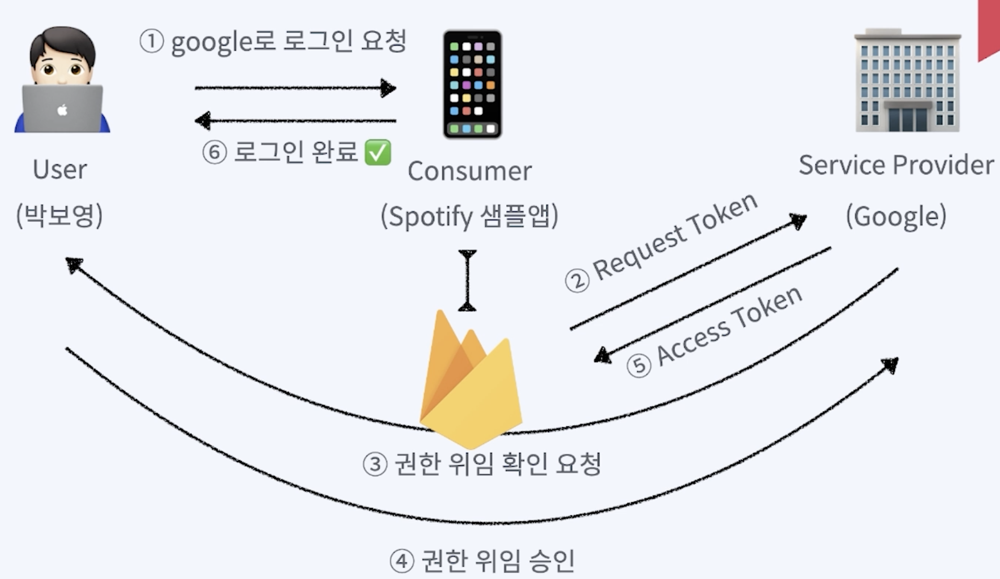

> # [swift] Intermediate_02. Firebase

 

# Firebase

## Firebase

Firebase란 IOS앱과 같은 모바일 기기 개발 플랫폼이다.  

 
 

## 대표적인 Firebase Platforms
 - Firebase Cloud Firestore
 - Firebase Auth
 - Firebase Realtime Database
 - Firebase A/B Testing
 - Firebase Cloud messaging
 - Firebase Remote Config

 
 
 

# OAuth

OAuth란?
 - 사용자 인증 방식에 대한 업계 표준
 - ID/PW를 노출하지 않고 OAuth를 사용하는 업체의 API 접근 권한을 위임 받음
 - 기본 개념
   - **User** Service Provider에 계정을 가지고 있는 사용자
   - **Consumer** Service Provider의 API(제공 기능)를 사용하려는 서비스 (App, Web 등)
   - **Service Provider** Oauth를 사용하여 API를 제공하는 서비스
   - **Access Token** 인증 완료 후 Service Provider의 제공 기능을 이용할 수 있는 권한을 위임받은 인증 키

 
 
 

# Firebase 인증

## Firebase 인증 절차

 
 

## Firebase 인증 제공 업체
 - 이메일/전화번호
 - 전화
 - Google
 - Play 게임
 - 게임 센터
 - FaceBook
 - Twitter
 - GitHub
 - Yahoo
 - Microsoft
 - Apple
 - 익명